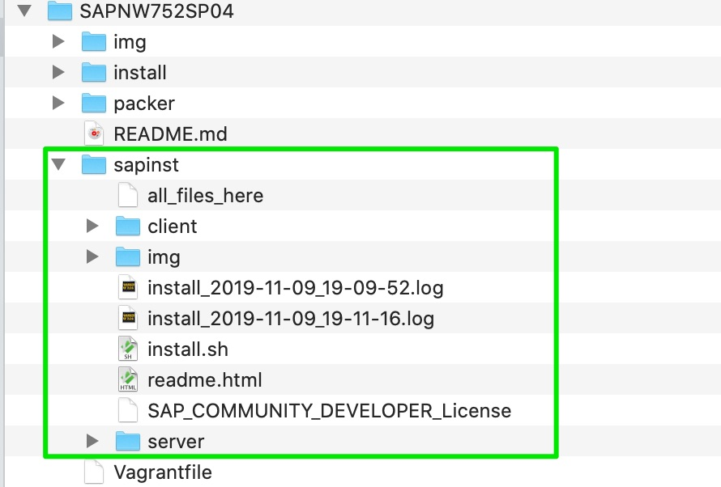
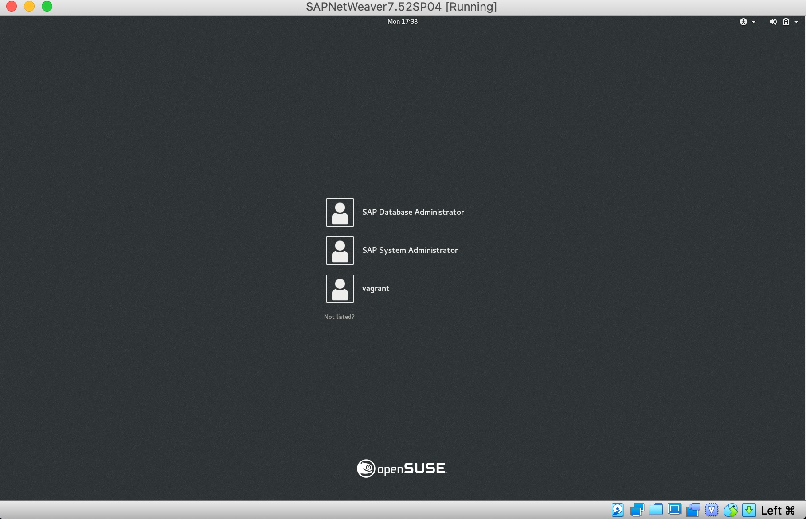
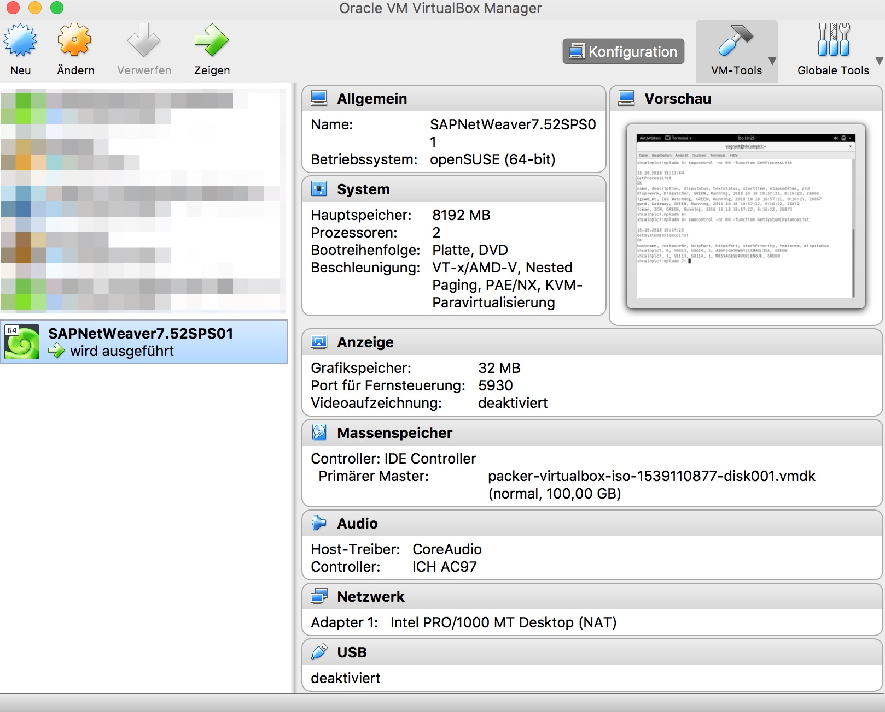
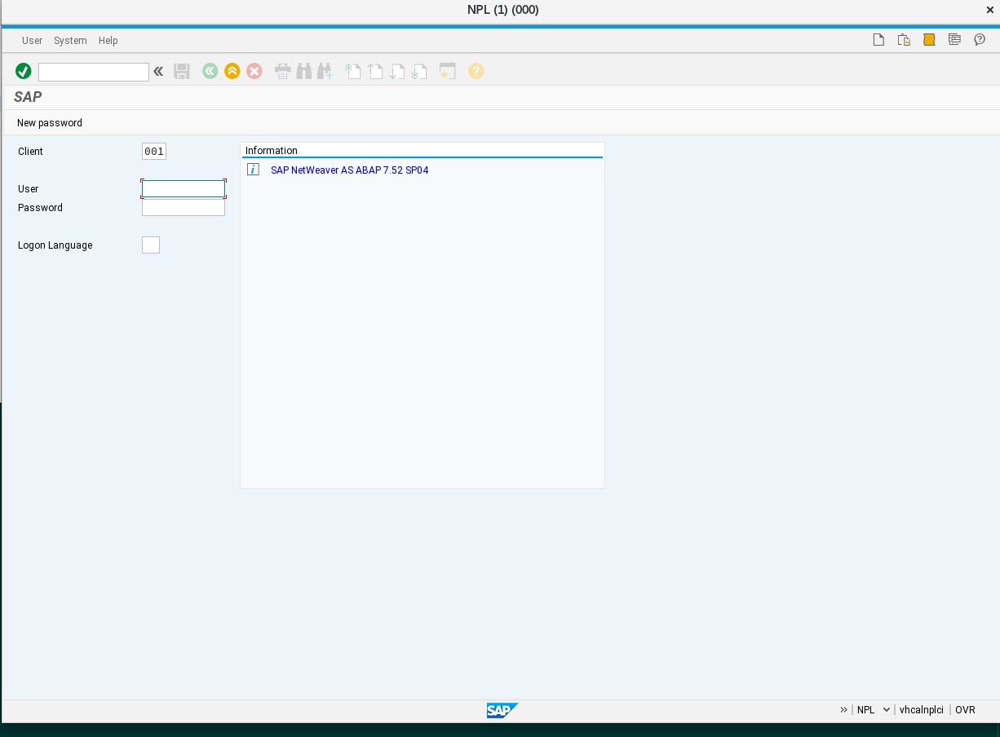

Introduction
============
The openSUSE Leap 15.1 Vagrant box can be used to create a VirtualBox instance with Vagrant to install [SAP NW AS ABAP 752 SP04 Developer Edition](https://blogs.sap.com/2019/07/01/as-abap-752-sp04-developer-edition-to-download/) .
 
 All recommended system preparations are done by packer and vagrant, as described at [Installing ABAP AS on Oracle VirtualBox](https://www.sap.com/documents/2019/09/32638f18-687d-0010-87a3-c30de2ffd8ff.html).

 The pre-built Vagrant Box is now avaiable on HashiCorps Vagrant Cloud:

 https://app.vagrantup.com/wechris

 The Packer calls are no longer necessary. If you want to create your own Vagrant Box with Packer see the optional section below.

 The Vagrantfile makes the following settings automatically:
 - uuidd.sh => installes and starts the UUIDD service
 - changetogerman.sh => changes the keyboard layout to german
 - gnome.sh => installes the Gnome Desktop, FireFox, VSCode, Chromium, Gnome-Terminal, GVim, Libreoffice, Nautilus Explorer, YAST2 and JAVA SAP Machine 11 + OpenJFX (to get ready to install SAPGUI JAVA)
 - sapinst.sh (+install_nw_expect) => installes the SAP NW AS ABAP 7.52 SP04 – Developer Edition is the installation files are avaiable in the `./sapint` folder
 - autostart.sh => appends the appends the `"Autostart = 1"` to the DEFAULT.PFL profile file.
 
Prerequisites
=============
 
On OS X VirtualBox and Vagrant, is available via [Homebrew](http://brew.sh/) on Windows via [Chocolatey](https://chocolatey.org).

OS X: 
```
$ brew install virtualbox
$ brew install vagrant
```
optional:
```
$ brew install vagrant-manager
```
 
Usage
=====
Clone the reporitory [wechris/SAPNW752SP04](https://github.com/wechris/SAPNW752SP04). 

Download and extract the [TD752SP04.partXX.rar](https://developers.sap.com/trials-downloads.html) files to the folder: *./sapinst*

The actual download (in the form of several .rar files), along with more information, is available here:

[SAPStore: ABAP 7.52SP04](https://developers.sap.com/trials-downloads.html)

Search for “7.52 SP04” for convenience.

Download and uncompress all files to:

```
./sapinst/
```
without the folder: *./TD752SP04*



**Vagrantfile**

Only VirtualBox:

If the german keyboard is not desired, comment the following line in the Vagrantfile
````
# config.vm.provision "shell", path: "install/changetogerman.sh"
````
If the gnome desktop is not desired, comment the following line in the Vagrantfile
````
# config.vm.provision "shell", path: "install/gnome.sh"
````

If the autom. installation of the SAP Netweaver 7.52SP04 is not desired, comment the following line in the Vagrantfile
````
# config.vm.provision "shell", path: "install/sapinst.sh"
````

If the Autostart function is not desired, comment the following line in the Vagrantfile

````
# config.vm.provision "shell", path: "install/autostart.sh"
````

Disable the UI of VirtualBox, comment the following line in the Vagrantfile

````
# vb.gui = true
````

**Vagrant start**

```
vagrant up --provision --provider virtualbox
```
or with debug option for more details:
```
vagrant up --provision --provider virtualbox --debug 2>&1 | Tee-Object -FilePath ".\vagrant.log"
```
On Windows Powershell
```
vagrant up --provision --provider virtualbox &> vagrant.log
```
or with debug option for more details:
```
vagrant up --provision --provider virtualbox --debug &> vagrant.log
```

Wait until the vagrant command is finished. Then restart the instance with:
```
vagrant reload
```

The vagrant box `SAPNetWeaver7.52SP04` comes up with the login screen of Gnome Desktop.


Now you can use the VirtualBox UI, if the UI option was activated:



**Login**

*Logins:*
- vagrant/vagrant
- root/vagrant
- npladm/ *pwd from install_nw_expect Default: Down1oad*

or use SSH into a running Vagrant machine:
```
vagrant ssh
```

*Start/Stop the VBox with:*
````
vagrant up
vagrant halt
````
or with the virtualbox UI. (The `/vagrant` folder will not be avaiable without the vagrant command!)


Post and optional installation steps
===

**SAPGUI JAVA installation**

The folder `/vagrant/sapinst/client/JavaGUI/contains the installation files of SAPGUI JAVA: _PlatinGUI750_5-80002496.JAR_.

run:
```
java -jar PlatinGUI750_5-80002496.JAR
```
and follow the installation. Click on the `New` icon, fill the fields and enter the following connection on the panel `Advanced`:
````
conn=/H/127.0.0.1/S/3200
````
Open the new JavaGUIService:



SAPGUI Login Info: 
The installed system providesthe following SAP users in client 001:Note: In general,you should develop using DEVELOPER or BWDEVELOPER (for BI content). SAP* is only for admin purposes, eg renewing the license.
Username - DDIC           Password Down1oad
Username - SAP*           Password Down1oad
Username - DEVELOPER      Password Down1oad
Username - BWDEVELOPER    Password Down1oad

You will then be promted 

**Manual install of SAP NW AS ABAP 752 SP04 Developer Edition**

The files and folder, on the same level as the vagrant file, will be available under /vagrant
````
sudo -i
<enter pwd Default: vagrant>
cd /vagrant/sapinst
./install.sh -s
````
Installation options:

* ./install.sh – installs the Developer Edition in dark mode, the installer will configure the SAP system for usage of the physical hostname
* ./install.sh -g– will present you a SAPINST GUI allowing you to modify certain system parameters
* ./install.sh -h <own hostname>– allows you to specify your own hostname to be used by the SAP system
* ./install.sh -s – allows you to skip the hostname check )

Read and accept the license agreement.
When prompted for the OS users password enter your master password of the virtual Linux OS instance.

Start the SAP system:
- Switch to user npladm in the console : **su npladm**
- Start the SAP system : **startsap ALL**


Additional informations, License key and first steps follow [SAP NW AS ABAP 7.52 SP04 – Developer Edition to Download: Concise Installation Guide](https://blogs.sap.com/2019/10/01/as-abap-7.52-sp04-developer-edition-concise-installation-guide/)

Optional
=====

The Packer template to build the openSUSE Leap 15.1 Vagrant box is available [here](https://github.com/wechris/SAPNW752SP04/tree/master/packer/openSUSE-Leap-15.1)

**Packer** 
```
cd packer
cd openSUSE-15.1
$ packer build -only=virtualbox-iso template.json
```

And change the following line in the Vagrant file:
```
config.vm.box = "openSUSE-15.1"
config.vm.hostname = "vhcalnplci"
config.vm.box_url = "./packer/openSUSE-15.1/openSUSE-15.1-virtualbox.box"

#  config.vm.box = "wechris/OpenSUSE-15.1_sapnw752"
#  config.vm.hostname = "vhcalnplci"
#  config.vm.box_version = "1.0.0"
```
The Vagrant box will be loaded locally.
